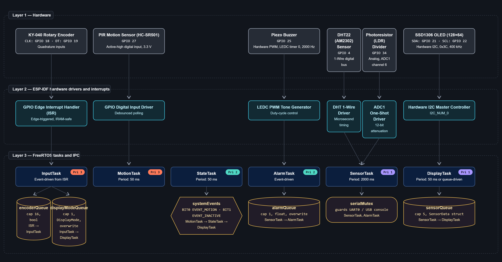
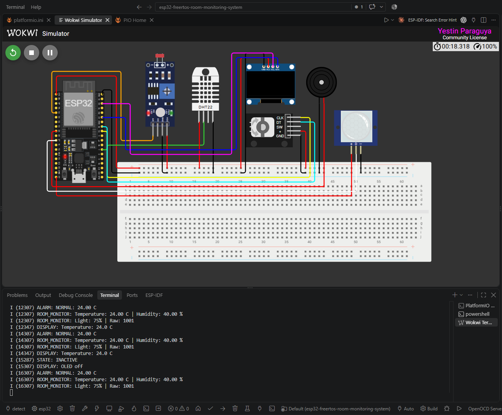
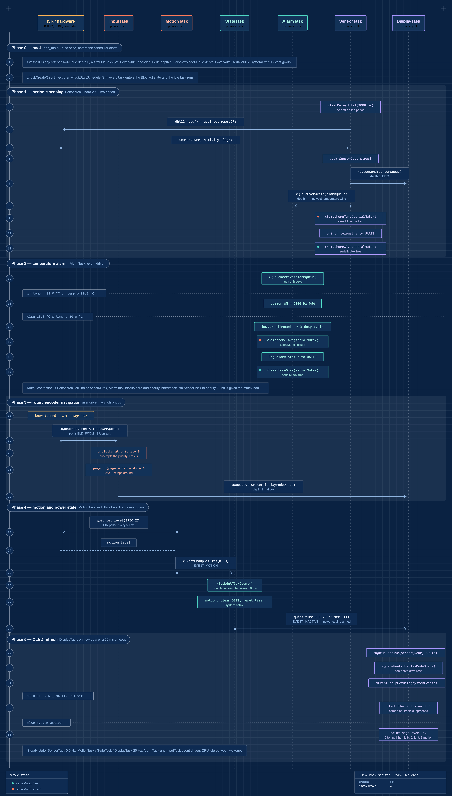
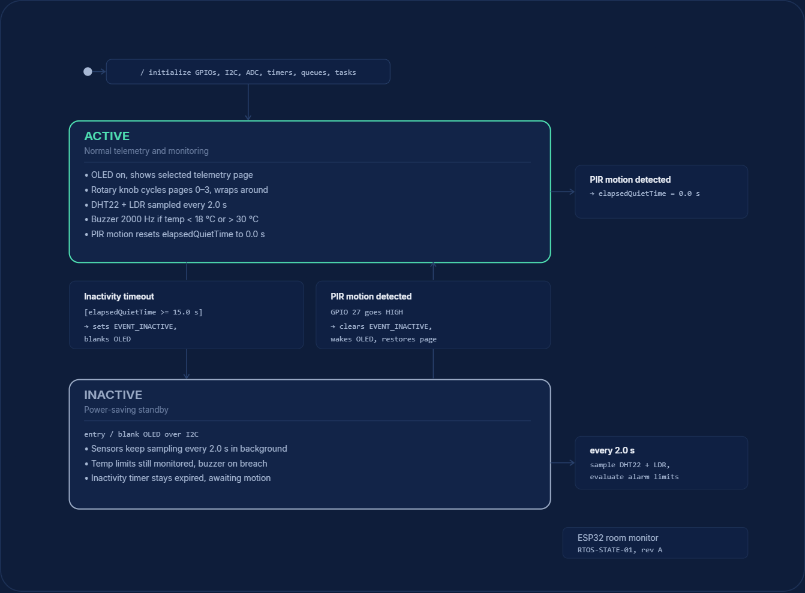
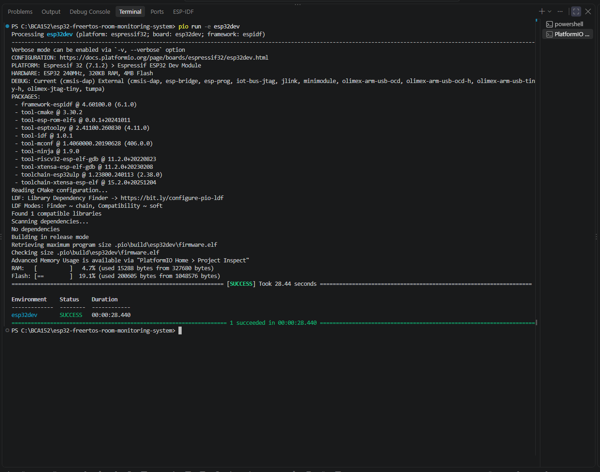
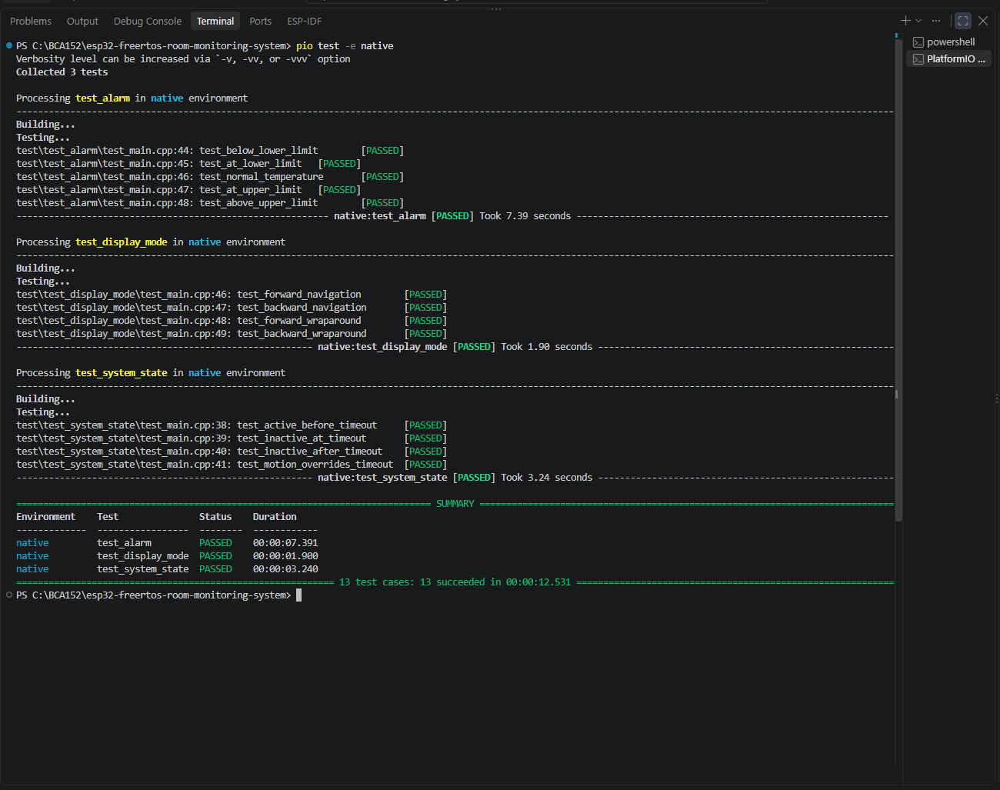
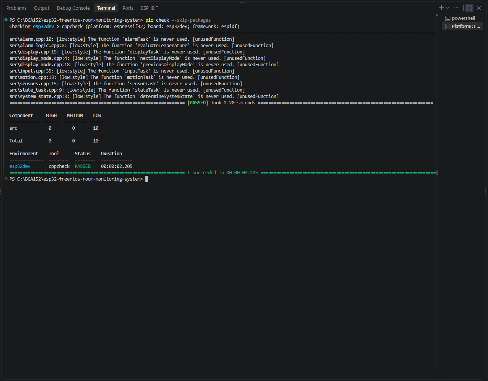

<div align="center">

# Real-Time Multisensor Room Monitoring System

 &nbsp;
 &nbsp;
 &nbsp;
 &nbsp;


**A concurrent embedded monitoring system built on ESP32 with FreeRTOS · Six preemptive tasks · Zero missed inputs · Drift-free timing**

<br>

[](https://platformio.org/)
[](https://www.espressif.com/)
[](https://www.freertos.org/)
[](docs/images/unit_tests_pass.png)
[](docs/images/static_analysis_pass.png)
[](https://wokwi.com/)

<br>

[ **View Demo**](https://youtu.be/mw-oIcxFS5U) &nbsp;·&nbsp;
[ **Lab Report**](docs/laboratory-report.pdf) &nbsp;·&nbsp;
[ **Hackster Article**](https://www.hackster.io/xavieryyyyyy/real-time-multisensor-room-monitoring-system-635154)

</div>

---

<div align="center">

https://github.com/user-attachments/assets/f00755b4-baf9-45d9-9289-22a3574bfbf0

_ Real-time system demonstration running in Wokwi simulator · [Watch on YouTube](https://youtu.be/mw-oIcxFS5U)_

</div>

---

##  &nbsp; Table of Contents

- [About](#about)
- [Features](#features)
- [Architecture](#architecture)
- [Hardware & Circuit](#hardware-circuit)
- [FreeRTOS Task Design](#freertos-task-design)
- [Inter-Task Communication](#inter-task-communication)
- [State Machine](#state-machine)
- [Getting Started](#getting-started)
- [Testing](#testing)
- [Static Code Analysis](#static-code-analysis)
- [Functional Verification](#functional-verification)
- [Engineering Decisions](#engineering-decisions)
- [Project Structure](#project-structure)
- [Limitations & Future Work](#limitations-future-work)
- [References](#references)

---

## <a id="about"></a> &nbsp; About

In facilities like **server rooms**, **medicine storage**, and **greenhouses**, environmental conditions must stay within safe limits, or expensive equipment gets damaged and critical supplies are ruined.

Most beginner microcontroller projects use a single **super-loop** (`while(1)`), where the processor handles tasks sequentially. This breaks down when sensors have slow communication protocols:

|  Problem |  Impact |
| :------------------------------------------------------------------------------------------------------------ | :---------------------------------------------------------------------------------------------------- |
| DHT22 sensor read takes **25 ms**                                                                             | Processor frozen, missing knob turns                                                                  |
| OLED screen refresh takes **10-15 ms**                                                                        | Motion events lost during screen update                                                               |
| Simple `delay()` calls                                                                                        | Timing drift accumulates over hours                                                                   |

**This project solves it** by splitting the program into **six independent FreeRTOS tasks** with priority-based preemptive scheduling. Slow background routines pause instantly when user input or motion occurs.

>  **Course:** BCA152 Microcontrollers, MSU-IIT, College of Computer Studies, Department of Computer Applications
>
>  **Instructor:** Asst. Prof. Paul Rodolf P. Castor, M.Sc.

---

## <a id="features"></a> &nbsp; Features

|                                                                                                    | Feature               | Description                                                        |
| :------------------------------------------------------------------------------------------------: | :-------------------- | :----------------------------------------------------------------- |
|        | **Concurrency**       | Six preemptive FreeRTOS tasks scheduled by urgency                 |
|        | **Drift-Free Timing** | Periodic sampling with `vTaskDelayUntil()` ,  no accumulative drift |
|         | **Thread Safety**     | FreeRTOS queues for data passing, no unprotected globals          |
|     | **Serial Protection** | Mutex-guarded UART output, preventing garbled text                        |
|        | **Event Signaling**   | Event group bits for motion and screen timeout                     |
|       | **Navigation**        | 4-page rotary encoder with continuous wraparound                   |
|    | **Safety Alarm**      | 2000 Hz hardware PWM buzzer when temp < 18°C or > 30°C             |
|         | **Power Saving**      | Auto-blank OLED after 15s of no motion, instant wake-up            |
|   | **Testing**           | 13 automated Unity unit tests on host PC                           |
|  | **Code Quality**      | Zero-defect static analysis with cppcheck                          |

---

## <a id="architecture"></a> &nbsp; Architecture

The codebase is organized into **three clean layers** ,  separating hardware drivers from OS primitives from pure logic. This lets us test decision functions on a computer without touching the ESP32.

```
┌─────────────────────────────────────────────────┐
│          Pure Decision Logic Layer               │
│   alarm_logic.cpp · display_mode.cpp ·           │
│   system_state.cpp                               │
│   (Zero hardware deps, fully unit-testable)     │
├─────────────────────────────────────────────────┤
│        FreeRTOS Synchronization Layer            │
│   rtos_objects.cpp · main.cpp                    │
│   (Queues · Mutexes · Event Groups · Tasks)      │
├─────────────────────────────────────────────────┤
│          Hardware Driver Layer                   │
│   sensors.cpp · display.cpp · input.cpp ·        │
│   motion.cpp · alarm.cpp                         │
│   (GPIO · ADC · I2C · PWM · ISR)                 │
└─────────────────────────────────────────────────┘
```


_ Three-layer architecture: physical sensors → ESP-IDF drivers → FreeRTOS tasks with IPC queues_

---

## <a id="hardware-circuit"></a> &nbsp; Hardware & Circuit

###  Components

|                                                                                                    | Component           | Function               |   GPIO    | Protocol              |
| :------------------------------------------------------------------------------------------------: | :------------------ | :--------------------- | :-------: | :-------------------- |
|  | DHT22 (AM2302)      | Temperature & humidity |    `4`    | 1-Wire digital        |
|          | Photoresistor (LDR) | Ambient light level    |   `34`    | ADC1 Ch6 (analog)     |
|      | SSD1306 OLED        | 128×64 display         | `21`/`22` | I2C @ 400kHz          |
|       | KY-040 Encoder      | Page navigation knob   | `18`/`19` | Hardware interrupts   |
|     | Piezo Buzzer        | Temperature alarm      |   `25`    | LEDC PWM              |
|        | PIR Motion Sensor   | Human detection        |   `27`    | Digital (active high) |

###  Wiring Diagram


_ESP32 DevKit-C v4 wired to all six peripheral modules in Wokwi simulator_

---

## <a id="freertos-task-design"></a> &nbsp; FreeRTOS Task Design

Six tasks run concurrently, each with dedicated stack memory, priority, and execution schedule:

```
Priority 3 ██████████  InputTask    ← Encoder clicks (< 0.1 ms)
Priority 3 ██████████  MotionTask   ← PIR sampling   (< 0.1 ms)
Priority 2 ███████     AlarmTask    ← Temp evaluation (< 0.5 ms)
Priority 2 ███████     StateTask    ← Timeout check   (< 0.5 ms)
Priority 1 ████        SensorTask   ← DHT22 + ADC     (~ 25 ms)
Priority 1 ████        DisplayTask  ← OLED refresh    (~ 15 ms)
```

| Task                                                                                                              | Stack  | Priority | Trigger       | Block Condition               |
| :---------------------------------------------------------------------------------------------------------------- | :----: | :------: | :------------ | :---------------------------- |
|  **SensorTask** | 2048 B |    1     | Every 2000 ms | `vTaskDelayUntil()`           |
|  **DisplayTask**    | 4096 B |    1     | Event / 50 ms | `xQueueReceive(sensorQueue)`  |
|  **AlarmTask**    | 3072 B |    2     | Event-driven  | `xQueueReceive(alarmQueue)`   |
|  **StateTask**        | 2048 B |    2     | Every 50 ms   | `vTaskDelayUntil()`           |
|  **MotionTask**       | 2048 B |    3     | Every 50 ms   | `vTaskDelay()`                |
|  **InputTask**       | 3072 B |    3     | ISR event     | `xQueueReceive(encoderQueue)` |

>  **Why these priorities?** Fast user-facing tasks (knob, motion) get Priority 3 because their signals last only milliseconds. Slow I/O tasks (sensor read, screen draw) get Priority 1 so they never block user inputs.


_Task execution timeline: boot → sensing → alarm evaluation → screen refresh_

---

## <a id="inter-task-communication"></a> &nbsp; Inter-Task Communication

Tasks exchange data through **typed, thread-safe channels** ,  never raw global variables:

```
SensorTask ──► sensorQueue (5 items) ──► DisplayTask
           ──► alarmQueue  (1 item)  ──► AlarmTask

ISR ──► encoderQueue (16 items) ──► InputTask ──► displayModeQueue ──► DisplayTask

MotionTask ──► systemEvents[BIT0] ──► StateTask ──► systemEvents[BIT1] ──► DisplayTask
```

|  Mechanism | Purpose                                                      |
| :---------------------------------------------------------------------------------------------------- | :----------------------------------------------------------- |
| **`sensorQueue`**                                                                                     | Full sensor packets → display rendering                      |
| **`alarmQueue`**                                                                                      | Latest temperature only (`xQueueOverwrite`) → buzzer control |
| **`encoderQueue`**                                                                                    | Turn directions from ISR → page switching                    |
| **`displayModeQueue`**                                                                                | Active page selection → display task                         |
| **`systemEvents`**                                                                                    | BIT0 = motion detected · BIT1 = inactive timeout             |
| **`serialMutex`**                                                                                     | Exclusive UART access, preventing garbled serial output       |

---

## <a id="state-machine"></a> &nbsp; State Machine

The system conserves power with a **two-state machine**:

```
                    ┌──────────────┐
          Motion ──►│    ACTIVE    │◄── Motion detected
          detected  │  OLED ON     │    (instant wake)
                    │  Sensors ON  │
                    └──────┬───────┘
                           │
                    No motion for
                      15 seconds
                           │
                    ┌──────▼───────┐
                    │   INACTIVE   │
                    │  OLED OFF    │
                    │  Sensors ON  │
                    │  Alarm ON    │
                    └──────────────┘
```


_ACTIVE ↔ INACTIVE transitions based on PIR motion detection_

---

## <a id="getting-started"></a> &nbsp; Getting Started

###  Prerequisites

- [Visual Studio Code](https://code.visualstudio.com/) with **PlatformIO** extension
- [Wokwi Simulator](https://wokwi.com/) extension for VS Code
- Git

###  Installation

```bash
git clone https://github.com/xavieryyyyyy/esp32-freertos-room-monitoring-system.git
cd esp32-freertos-room-monitoring-system
```

###  Build

```bash
pio run -e esp32dev
```


_RAM: 4.7% (15,288 / 327,680 B) · Flash: 19.1% (200,605 / 1,048,576 B)_

###  Run Simulation

1. Build the firmware (`pio run -e esp32dev`)
2. Open `diagram.json` in VS Code
3. Press `Ctrl+Shift+P` → **Wokwi: Start Simulator**
4. Serial monitor opens at 115200 baud, OLED shows `ROOM MONITOR`

---

## <a id="testing"></a> &nbsp; Testing

### Unit Tests: 13/13 Passing

Pure decision logic is tested on your computer with no hardware needed:

```bash
pio test -e native
```



<details>
<summary> &nbsp; <b>View all 13 test results</b></summary>

<br>

| Suite               | Test                            | Scenario                     |                                               Result                                                |
| :------------------ | :------------------------------ | :--------------------------- | :-------------------------------------------------------------------------------------------------: |
| `test_alarm`        | `test_below_lower_limit`        | 17.9°C → ALARM_LOW           |  |
| `test_alarm`        | `test_at_lower_limit`           | 18.0°C → ALARM_OK            |  |
| `test_alarm`        | `test_normal_temperature`       | 24.0°C → ALARM_OK            |  |
| `test_alarm`        | `test_at_upper_limit`           | 30.0°C → ALARM_OK            |  |
| `test_alarm`        | `test_above_upper_limit`        | 30.1°C → ALARM_HIGH          |  |
| `test_display_mode` | `test_forward_navigation`       | Temp → Hum → Light → Motion  |  |
| `test_display_mode` | `test_backward_navigation`      | Motion → Light → Hum → Temp  |  |
| `test_display_mode` | `test_forward_wraparound`       | Motion → wraps to Temp       |  |
| `test_display_mode` | `test_backward_wraparound`      | Temp → wraps to Motion       |  |
| `test_system_state` | `test_active_before_timeout`    | 14.99s → stays ACTIVE        |  |
| `test_system_state` | `test_inactive_at_timeout`      | 15.00s → INACTIVE            |  |
| `test_system_state` | `test_inactive_after_timeout`   | >15s → stays INACTIVE        |  |
| `test_system_state` | `test_motion_overrides_timeout` | Motion → stays ACTIVE at 20s |  |

</details>

---

## <a id="static-code-analysis"></a> &nbsp; Static Code Analysis

```bash
pio check --skip-packages
```



**Result: 0 memory leaks · 0 buffer overflows · 0 null pointer dereferences**

<details>
<summary> &nbsp; <b>View detailed findings</b></summary>

<br>

All findings are expected low-severity style notes because FreeRTOS tasks are registered as function pointers via `xTaskCreate()`, not called directly:

| Finding                   | File                    | Severity | Resolution                           |
| :------------------------ | :---------------------- | :------- | :----------------------------------- |
| `unusedFunction`          | `alarm.cpp:10`          | Style    | Task registered via `xTaskCreate()`  |
| `unusedFunction`          | `display.cpp:15`        | Style    | Task registered via `xTaskCreate()`  |
| `unusedFunction`          | `input.cpp:35`          | Style    | Task registered via `xTaskCreate()`  |
| `unusedFunction`          | `motion.cpp:13`         | Style    | Task registered via `xTaskCreate()`  |
| `unusedFunction`          | `sensors.cpp:15`        | Style    | Task registered via `xTaskCreate()`  |
| `unusedFunction`          | `state_task.cpp:9`      | Style    | Task registered via `xTaskCreate()`  |
| `unusedFunction`          | `alarm_logic.cpp:8`     | Style    | Called cross-file, tested in native  |
| `unusedFunction`          | `display_mode.cpp:4,18` | Style    | Called cross-file, tested in native  |
| `unusedFunction`          | `system_state.cpp:3`    | Style    | Called cross-file, tested in native  |
| `deprecated-declarations` | `alarm.cpp:26`          | Warning  | Removed; driver defaults to disabled |

</details>

---

## <a id="functional-verification"></a> &nbsp; Functional Verification

All 10 functional requirements validated in the Wokwi simulator:

| Test  | Requirement                  | Action                |                                               Result                                                |
| :---: | :--------------------------- | :-------------------- | :-------------------------------------------------------------------------------------------------: |
| FT-01 | FR-01: Temperature display   | Adjust DHT22 slider   |  |
| FT-02 | FR-02: Humidity display      | Adjust DHT22 slider   |  |
| FT-03 | FR-03: Light percentage      | Adjust LDR slider     |  |
| FT-04 | FR-06: Clockwise nav         | Rotate encoder CW     |  |
| FT-05 | FR-06: Counter-clockwise nav | Rotate encoder CCW    |  |
| FT-06 | FR-07: Temperature alarm ON  | Temp < 18°C or > 30°C |  |
| FT-07 | FR-07: Alarm clearance       | Return to 21.4°C      |  |
| FT-08 | FR-04/08: Motion detection   | Trigger PIR sensor    |  |
| FT-09 | FR-09: Inactivity timeout    | Idle for 15 seconds   |  |
| FT-10 | FR-10: Motion wake-up        | Trigger PIR while off |  |

>  **Video demonstration:** [Watch the full 3-minute demo on YouTube](https://youtu.be/mw-oIcxFS5U), or play the local recording below:

<details>
<summary> <b>system_running.mp4</b></summary>

https://github.com/user-attachments/assets/f00755b4-baf9-45d9-9289-22a3574bfbf0

</details>

---

## <a id="engineering-decisions"></a> &nbsp; Engineering Decisions

<details>
<summary> &nbsp; <b>Why native ESP-IDF instead of Arduino?</b></summary>

<br>

Arduino's `delay()` and `Serial.print()` hide FreeRTOS mechanics and cause blocking. Native ESP-IDF gives direct control over task stacks, priorities, and hardware peripherals.

</details>

<details>
<summary> &nbsp; <b>Why vTaskDelayUntil() instead of vTaskDelay()?</b></summary>

<br>

`vTaskDelay()` pauses _relative_ to when called. If sensor reading takes 30ms, the total cycle becomes 2030ms. `vTaskDelayUntil()` calculates _absolute_ tick targets, keeping intervals exactly at 2000ms regardless of execution time.

</details>

<details>
<summary> &nbsp; <b>Why separate queues for display and alarm?</b></summary>

<br>

FreeRTOS queue reads are destructive because the item is removed on read. If display and alarm shared one queue, whichever read first would starve the other. Separate queues guarantee both tasks receive the data.

</details>

<details>
<summary> &nbsp; <b>Why xQueueOverwrite() for alarms?</b></summary>

<br>

The alarm task doesn't need a backlog of old temperatures. It only needs the freshest value to decide if the buzzer should sound _right now_.

</details>

<details>
<summary> &nbsp; <b>Why invert the LDR reading?</b></summary>

<br>

Raw ADC (0 to 4095) is inverted to a percentage: `Light% = (4095 - raw) × 100 / 4095`. This maps darkness to 0% and bright light to 100%, intuitive for users.

</details>

---

## <a id="project-structure"></a> &nbsp; Project Structure

```
esp32-freertos-room-monitoring-system/
│
├── docs/
│   ├── images/                       # Screenshots, diagrams, video demo
│   │   ├── wokwi_circuit.png
│   │   ├── system_architecture.png
│   │   ├── freertos-sequence.png
│   │   ├── state_machine.png
│   │   ├── system_running.png
│   │   ├── system_running.mp4        # Standalone video demonstration (< 50 MB)
│   │   ├── build_success.png
│   │   ├── unit_tests_pass.png
│   │   └── static_analysis_pass.png
│   └── laboratory-report.pdf         # Comprehensive technical laboratory report
│
├── include/                          # Header declarations
│   ├── alarm.h
│   ├── display.h
│   ├── display_mode.h
│   ├── input.h
│   ├── motion.h
│   ├── rtos_objects.h
│   ├── sensor_data.h
│   ├── sensors.h
│   └── system_state.h
│
├── src/                              # Source implementations
│   ├── main.cpp                      # app_main() initialization entry point
│   ├── sensors.cpp                   # DHT22 + ADC LDR sampling
│   ├── display.cpp                   # SSD1306 OLED rendering
│   ├── input.cpp                     # Rotary encoder ISR + queue
│   ├── alarm.cpp                     # LEDC PWM buzzer control
│   ├── motion.cpp                    # PIR polling task
│   ├── state_task.cpp                # Inactivity state machine
│   ├── rtos_objects.cpp              # Queue/mutex/event instantiation
│   ├── alarm_logic.cpp               # Pure: evaluateTemperature()
│   ├── display_mode.cpp              # Pure: next/previousDisplayMode()
│   └── system_state.cpp              # Pure: determineSystemState()
│
├── test/                             # Unity unit tests (native)
│   ├── test_alarm/                   # 5 temperature boundary tests
│   ├── test_display_mode/            # 4 navigation wraparound tests
│   └── test_system_state/            # 4 timeout + motion tests
│
├── diagram.json                      # Wokwi circuit definition
├── platformio.ini                    # Build configuration
├── wokwi.toml                        # Simulator config
└── README.md
```

---

## <a id="limitations-future-work"></a> &nbsp; Limitations & Future Work

### Known Limitations

|  | Limitation            | Detail                                                                           |
| :-------------------------------------------------------------------------------------------------: | :-------------------- | :------------------------------------------------------------------------------- |
|                                                                                                     | **Simulation only**   | Wokwi doesn't model electrical noise, contact bounce, or thermal delays          |
|                                                                                                     | **OLED refresh**      | Full 1024-byte framebuffer over I2C takes 10-15 ms (mitigated by Priority 1)     |
|                                                                                                     | **ADC non-linearity** | ESP32 ADC is inaccurate near 0V and 3.3V; physical builds need eFuse calibration |

### Future Improvements

|         | Improvement                                                 |
| :------------------------------------------------------------------------------------------------: | :---------------------------------------------------------- |
|   | Store alarm limits in NVS flash (persist across reboots)    |
|         | Stream telemetry over Wi-Fi via MQTT                        |
|  | Use ULP co-processor for ultra-low-power motion monitoring  |
|        | Different buzzer tones for high vs low temperature warnings |

---

## <a id="references"></a> &nbsp; References

|                                                                                                       | Resource     | Link                                                                                                      |
| :---------------------------------------------------------------------------------------------------: | :----------- | :-------------------------------------------------------------------------------------------------------- |
|  | Course       | BCA152 Microcontrollers, MSU-IIT, College of Computer Studies, Department of Computer Applications       |
|            | Instructor   | Asst. Prof. Paul Rodolf P. Castor, M.Sc.                                                                  |
|             | Framework    | [Espressif ESP-IDF](https://docs.espressif.com/projects/esp-idf/) + [FreeRTOS](https://www.freertos.org/) |
|             | Simulator    | [Wokwi Embedded Systems Simulator](https://wokwi.com/)                                                    |
|          | Build System | [PlatformIO](https://platformio.org/)                                                                     |

---

<div align="center">


**Built for BCA152 Microcontrollers**

_Mindanao State University - Iligan Institute of Technology_

</div>
